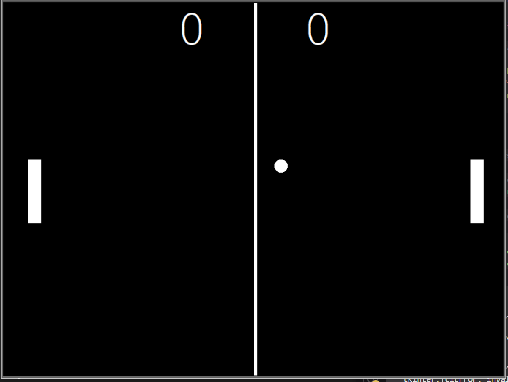

<!-- Title and Image -->

  

# Pong Game

## Overview
Pong is a classic arcade game where two players compete by controlling paddles to bounce a ball past their opponent. It's a test of reflexes and coordination, and now you can enjoy it on your computer!

## Features
- **Two-Player Mode**: Challenge a friend to play the game.
- **Customizable Controls**: Control your paddle with ease using custom keybindings.
- **Dynamic Ball Speed**: The ball starts slow and progressively speeds up, adding excitement.
- **Interactive Scoreboard**: Keep track of scores with a built-in scoreboard.
- **Immersive Separator**: A sleek white line separates the playing area, enhancing visuals.

## How to Play
1. Clone or download the game files.
2. Ensure you have Python and the Turtle graphics library installed.
3. Run the game:
4. Use your custom controls to move your paddle.
5. Score by getting the ball past your opponent.
6. Win by reaching the score limit before your opponent.

## Installation
To install the game, follow these steps:

1. Clone or download the game repository.
2. Make sure you have Python and the Turtle graphics library installed.
3. Run the game.

## Future Enhancements
We have exciting plans for the future, including:
- Sound effects for an immersive experience.
- Different difficulty levels to challenge all players.
- Power-ups, obstacles, and new game modes.
- Background music and stunning visual effects.
- Online multiplayer mode for remote play.

## License
This game is open-source. Feel free to modify, distribute, and use it for your own projects.

